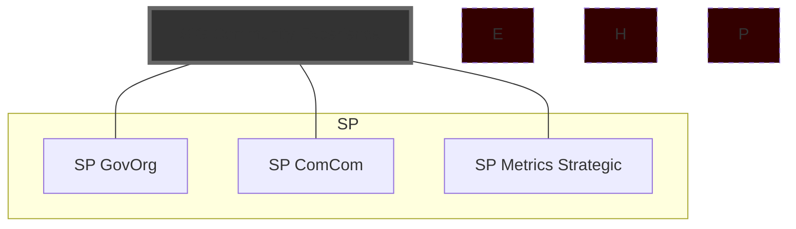

```mermaid
  flowchart TB
A[SIG Community Experience]
subgraph  SP
 B[SP GovOrg]
 C[SP ComCom] 
 D[SP Metrics Strategic]
end

      A --- B;
      A --- C;
      A --- D;

 
      style A fill:#333,stroke:#666,stroke-width:4px;
      style E fill:#300,stroke-dasharray: 5 5;
      style H fill:#300,stroke-dasharray: 5 5;
      style P fill:#300,stroke-dasharray: 5 5;
```
